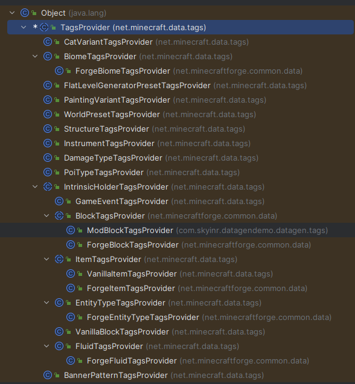

> 在编写你自己的`TagProvider`的时候，请务必多查找WIKI，查找你所需要的`Tag`。
# 各种Tag
众所周知，在`Minecraft`中有许多类型的`Tag`，理所当然的，也会有许多对应的`TagProvider`。\
以下为部分常用的`TagProvider`示例\
<big>**在Minecraft当中的各种TagProvider：**</big>


## BlockTag
### 继承父类
与1.18.2时不同，在1.20.1我们应该选择使用Forge的`BlockTagsProvider`\
你可能会问不是还有个`net.minecraftforge.common.data.ForgeBlockTagsProvider`类吗？ 这个类是`Forge`用来生成他们所**拓展**的，基于**原版**`Minecraft`的`BlockTag`。**并且该类是个常量类，无法继承。**\
你可能还会问`net.minecraft.data.tags.VanillaBlockTagsProvider`不是可以用吗？ 这个类对比Forge的`Provider`来说，这个类是基于原版的命名空间来生成的，这跟我们的需求来说是不一致的。
所以我们只需要继承`BlockTagsProvider`类并重写该类的`addTags`方法即可。\
### 简单的生成示例
简单的生成示例:
```java
public class ModBlockTagsProvider extends BlockTagsProvider {
    public ModBlockTagsProvider(PackOutput output, CompletableFuture<HolderLookup.Provider> lookupProvider, @Nullable ExistingFileHelper existingFileHelper) {
        super(output, lookupProvider, DataGenDemo.MODID, existingFileHelper);
    }

    @Override
    protected void addTags(HolderLookup.Provider pProvider) {
        addPickaxe(ModBlocks.BLOCK_DEMO.get());
        addAxe();
        addShovel();
        addHoe();
        addStoneTool(ModBlocks.BLOCK_DEMO.get());
        addIronTool();
        addDiamondTool();
    }

    protected final void addPickaxe(Block... blocks) {
        tag(BlockTags.MINEABLE_WITH_PICKAXE).add(blocks);
    }

    protected final void addAxe(Block... blocks) {
        tag(BlockTags.MINEABLE_WITH_AXE).add(blocks);
    }

    protected final void addShovel(Block... blocks) {
        tag(BlockTags.MINEABLE_WITH_SHOVEL).add(blocks);
    }

    protected final void addHoe(Block... blocks) {
        tag(BlockTags.MINEABLE_WITH_HOE).add(blocks);
    }

    protected final void addStoneTool(Block... blocks) {
        tag(BlockTags.NEEDS_STONE_TOOL).add(blocks);
    }

    protected final void addIronTool(Block... blocks) {
        tag(BlockTags.NEEDS_IRON_TOOL).add(blocks);
    }

    protected final void addDiamondTool(Block... blocks) {
        tag(BlockTags.NEEDS_DIAMOND_TOOL).add(blocks);
    }


    /**
     * 用于在日志内输出对应的Provider的ID
     */
    @Override
    @NotNull
    public String getName() {
        return "BlockTagsGen:" + DataGenDemo.MODID;
    }
}
```
## ItemTag
`ItemTag`与[BlockTag](1.20/3?id=BlockTag)总体结构相同，唯一的区别在于`net.minecraft.data.tags.ItemTagsProvider`内有一个`copy`方法，用于将`BlockTag`的内容拷贝至`ItemTag`内。

## FluidTag
`FluidTag`也与[BlockTag](1.20/3?id=BlockTag)总体结构相同,只需要继承`net.minecraft.data.tags.FluidTagsProvider`即可。

## ConfiguredStructureTags
`ConfiguredStructureTag`用于向结构标记内添加内联结构。\
也就是说你只需要往`ConfiguredStructureTags.VILLAGE`内`add`一个`ResourceKey<Structure>`就可以往村庄里面加内容了。\

## GameEventTag
用于向原版的游戏事件添加Tag，目前用于循声者。

## EntityTypeTag
`EntityTypeTag`用于生成生物的Tag。简单说明:如果想让你的生物可以在袭击里面生成，那么只需要`this.tag(EntityTypeTags.RAIDERS).add(YourEntityType);`

## BiomeTag
`BiomeTag`用于将群系类型归类成一类Tag，可以用于生成地物。