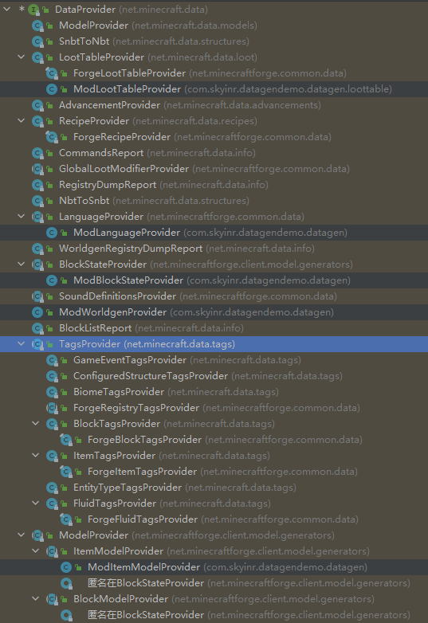

# 简单的准备工作
## 了解Datagen
在正式使用Datagen之前，我们要了解一下在Forge中Datagen是如何使用的。\
我们首先要了解一下Datagen的核心`DataProvider`，所有的Datagen都实现了这个接口，我们也可以去实现这个接口来自定义我们的生成器，但是一般情况下我们是选择直接继承对应的类，然后稍做修改。
实现了这个接口的类有:\

## 事件的监听与注册
第一步我们要监听`GatherDataEvent`事件并注册监听器到Mod总线:
```Java
@Mod.EventBusSubscriber(bus = Mod.EventBusSubscriber.Bus.MOD, modid = DataGenDemo.MODID)
public class DataGenEvent {
    @SubscribeEvent
    public static void register(GatherDataEvent event) {
        ExistingFileHelper helper = event.getExistingFileHelper();
        if (event.includeClient()) {
            //block/item models, blockstates, language files...
        }
        if (event.includeServer()) {
            //recipes,advancements,tags...
        }
        if (event..includeReports()){
            //world
        }
    }
}
```